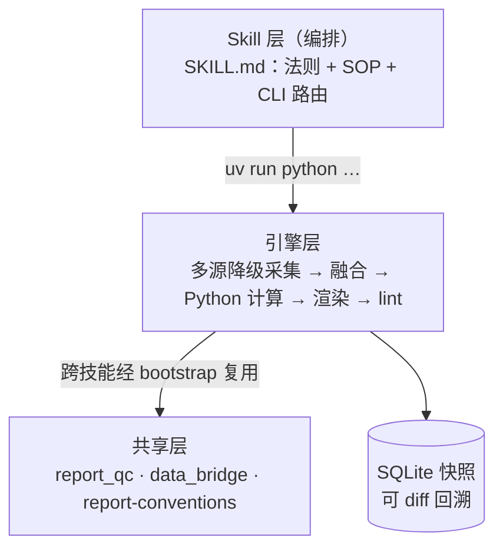
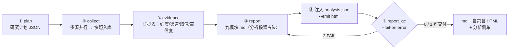
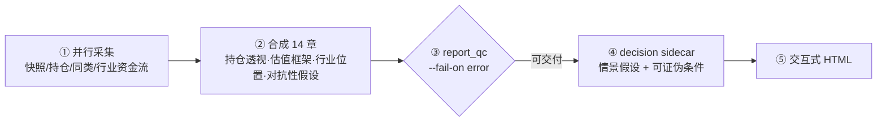
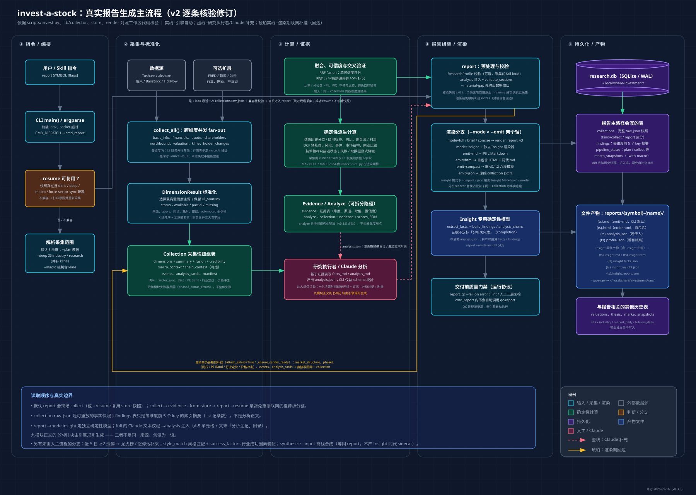

# invest-skills — 可复核的 A 股研究技能集

<p align="center">
  <a href="LICENSE"></a>
  <a href="https://www.python.org/downloads/"></a>
  <a href="https://github.com/Veblin/invest-skills/actions/workflows/validate.yml"></a>
  <a href="https://github.com/Veblin/invest-skills/releases"></a>
  <a href="#workbuddy"></a>
</p>

**每个数字可复核的 A 股投研助手。** 输入代码，自动采集公开数据、由 Python 引擎完成计算，并输出带来源、口径与不确定性标注的研究备忘录。它将手工研究中最易出错的环节——数据取数、计算、交叉验证与证据整理——固化为可检查的流程；是学习与研究工具，不是投资决策工具。

> 普通 AI 给你「看起来对的分析」；invest-skills 给你一份**每个数字都能回溯到来源的研究备忘录**。

> **定位声明**：本项目是开源软件工具，不从事证券投资咨询业务，未取得证券投资咨询业务资格；不推荐个股、不提供买卖或仓位建议、不承诺收益。完整边界见[免责声明](#免责声明)。

<details>
<summary><b>English</b></summary>

**invest-skills** is a set of open-source Agent Skills for A-share (China mainland) equity research, plus a Hong Kong stock module.

Nine skills cover single-stock deep dives, ETF analysis, market sentiment, trade-plan review, event calendars, and three kinds of screening. Each skill drives a shared Python engine that pulls from multiple public data sources, computes every derived metric itself, and records the source, the caliber and the retrieval time for each figure. The model composes the narrative; it never does the arithmetic.

Before anything is delivered, the report must clear a machine quality gate (`report_qc --fail-on error`, exit code 0/1/2) covering compliance wording, structural completeness, sourcing, and cross-source divergence. Output is a self-contained offline HTML file plus Markdown, written to a local SQLite-backed snapshot store so results can be diffed over time.

Everything runs locally. No data is uploaded or tracked. Research tool — not investment advice.

</details>

## 为什么值得使用

| 研究中的常见失真 | 系统性约束 | 你可以如何复核 |
|:---|:---|:---|
| AI 心算、编数字或混淆口径 | **每个数字可复核**：Python 计算全部衍生指标；AI 只引用结果，不加工数字 | 数字附来源与日期，计算逻辑在脚本中可审计 |
| 单一数据源失效或数据彼此冲突 | 多源并行、降级链与差异显式标注；不会静默挑选一个数字 | 报告保留来源、口径和待核验路径 |
| 叙事压过证据，只谈利好 | 16 条输出法则、事实/分析分离、Bull/Bear 数值化传导 | 每条判断必须关联事实、来源或标记为待验证 |
| 同一问题每次得到不同话术 | 固定研究结构、科学计算和 SQLite 快照 | 历史结果可 diff 回溯，区分数据变化与观点变化 |
| 只看标的，忽略市场环境 | 个股、ETF、市场脉搏、形态与方案评估共用数据层 | 同一套公开数据下比较估值、情绪、资金与风险 |
| 不知道数据被送去了哪里 | 本地运行与可审计：数据不出机、不跟踪不上报、MIT 开源 | 代码可通读，SQLite 快照留在本地，支持 diff 回溯 |

## 研究链条

三层结构：**Skill 层**（编排）调用**引擎层**（采集 → 计算 → 渲染），跨技能共用**共享层**（规范与纯函数模块）。



这个链条的关键不是「自动写报告」，而是将研究中的证据责任落到可检查的层次：数据源失败会被记录；跨源数值冲突不会被悄悄抹平；无法证实的判断必须标注边界；技术指标仅描述市场状态，不生成交易信号。

### 两条交付链

每个技能都有一条固定的交付链——**机器准出是链上的一步，不是事后收尾**。

**个股（invest-a-stock）**：



**ETF（invest-a-etf）**：



想看到引擎内部的完整分支，下面是**引擎级完整流程图**（点击放大；图较密，缩略状态下文字不可读）：

[](docs/diagram/report-generation-flow-v2.svg)

这张图逐条核验了采集扇出、字段归一、渲染分支与落库表结构，读者是需要改代码或排查数据问题的人；
上面两条链给的则是**使用者视角**——同一条流程，不同的抽象层次。

## 能做什么

**核心研究**

| Skill | 研究对象与产出 | 入口 |
|:---|:---|:---|
| **invest-a-stock** | 单标的九模块研究：公司、财务、估值、资金、技术状态、事件与风险 | `/invest-a-stock 600176` |
| **invest-a-etf** | ETF 的指数估值、折溢价、AUM、跟踪质量与对冲覆盖 | `/invest-a-etf 563300` |
| **invest-a-pulse** | 市场杠杆、广度、情绪、资金与估值的交叉解读 | `/invest-a-pulse` |
| **invest-a-journal** | 对既有交易方案做逻辑、盲点、仓位匹配、风险收益四维检查 | `/invest-a-journal` |
| **invest-hk-stock** | 港股：快照与 K 线、南向资金、A/H 比价、双标的对比 | `/invest-hk-stock 00700` |

**发现与扫描**

| Skill | 研究对象与产出 | 入口 |
|:---|:---|:---|
| **invest-a-discover-scan** | 多透镜粗筛出研究观察短清单（≤15 只），每只附理由与下钻命令 | `/invest-a-discover-scan` |
| **invest-a-gap-scan** | 沪深 300 / 中证 A500 / 科创 50 成分股的客观跳空缺口筛查 | `/invest-a-gap-scan` |
| **invest-a-pattern-scan** | LMW 双底与三角形底的形态检出，附数据窥探防护 | `/invest-a-pattern-scan` |

**日程与排雷**

| Skill | 研究对象与产出 | 入口 |
|:---|:---|:---|
| **invest-a-event-calendar** | 宏观日程前瞻（中美 CPI / 社零 / 非农 / 议息）与限售解禁排雷 | `/invest-a-event-calendar` |

扫描或形态检出只说明数据是否满足预设定义，不构成交易信号或操作建议。

## 数据、计算与输出标准

| 维度 | 覆盖内容 | 主要数据路径 |
|:---|:---|:---|
| 基本面 | 公司画像、财务三表、ROE/EPS、杜邦、股东与资金 | Tushare ∥ AkShare |
| 行情与技术状态 | OHLCV、前复权 K 线、均线、MACD、RSI、波动率 | Tushare ∥ 腾讯；AkShare / Baostock / TickFlow 作为补充或降级 |
| 估值与宏观 | PE/PB 序列及分位、PE Band、ERP、美国国债利率 | Tushare；FRED；AkShare |
| ETF 与市场环境 | 折溢价、AUM、跟踪质量、市场广度、两融、情绪与资金 | AkShare / Tushare / 共用市场微观结构模块 |

报告遵循以下最低标准：

- 事实注明来源；分析注明依据；无法验证的内容明确标记为「待验证」。
- 分位数不脱离历史中位数使用；多源冲突并列呈现，不伪造确定性。
- Bull/Bear 需要给出可检查的数值传导与条件，而非形容词堆砌。
- 所有结果是本地 SQLite 快照；项目不跟踪、不上传用户的查询或持仓信息。

### 交付前的机器准出

[`skills/lib/report_qc.py`](skills/lib/report_qc.py) 对报告做分层检查，输出单一判定，退出码 **0 = PASS / 1 = WARN 可交付 / 2 = FAIL 不得交付**：

| 层 | 检查内容 |
|:---|:---|
| lint | 73 条合规与措辞规则（禁用买卖建议、点位断言、分位须伴随中位数等） |
| structure | 章节与标记存在性（`[事实]`/`[分析]` 对偶、证据标签、风险声明首尾） |
| completion | 占位符是否填净、同代分析侧车是否齐备 |
| sourcing | 派生表述是否缺来源、正文 §N 交叉引用是否指向存在的节 |
| derived | 引擎衍生字段的值域与精度 |
| conclusion-evidence | 结论段证据等级达标 |

**机器 PASS ≠ 可交付**：其后还有三层人工复检（数字重算 → 合规核对 → 逻辑自洽）。详细规则见 [invest-a-stock SKILL.md](skills/invest-a-stock/SKILL.md) 与[配置说明](CONFIGURATION.md)。

## 从真实产出看证据如何保留

下面这些都是**历史运行快照，仅用于展示格式与方法，不代表当前市场状态，也不构成任何建议**。

真实输出 [000338 潍柴动力（2026-07-21）](docs/demos/000338-潍柴动力-2026-07-21.md) 展示了系统不回避不确定性的方式：

| 问题 | 报告中的处理方式 |
|:---|:---|
| Tushare 与 AkShare 财务数据差异 102.4% | 保留双方数据与口径差异，给出核验路径，不擅自裁决 |
| PE(TTM) 20.3x、近四年中位数 15.1x、88.1% 分位 | 同时报出绝对值、基准与位置，避免只用单一分位下结论 |
| 60 日最大回撤 24.9% | 由引擎字段直接引用，不由 AI 推算 |
| 结论证据强度 | 以强弱、来源广度、时效性和跨源可验证性四维标注 |

同类样例：

| 样例 | 技能 | 生成日期 |
|:---|:---|:---|
| [中际旭创 复盘](docs/demos/300308-中际旭创-复盘-2026-08-04.md) | invest-a-stock（多报告对比） | 2026-08-04 |
| [科创 50 ETF](docs/demos/588000-科创50ETF-2026-08-08.md) | invest-a-etf | 2026-08-08 |
| [市场脉搏](docs/demos/market-pulse-2026-08-03.md) | invest-a-pulse | 2026-08-03 |
| [通信 ETF](docs/demos/515050-通信ETF-2026-09-19.md) | invest-a-etf（含三源资金口径对照） | 2026-09-19 |
| [腾讯控股](docs/demos/00700-腾讯控股-2026-09-12.md) | invest-hk-stock（港股线） | 2026-09-12 |

## 开始使用

选择你使用的平台即可；完整配置、Token 可选项与故障排查集中在 [CONFIGURATION.md](CONFIGURATION.md)，避免在这里重复维护教程。

| 平台 | 最短路径 |
|:---|:---|
| Claude Code | `/plugin marketplace add Veblin/invest-skills`，随后使用相应 `/invest-a-*` 入口 |
| Agent Skills 兼容平台 | `npx skills add Veblin/invest-skills` |
| DSH / Qoder / Trae / Kimi CLI | `git clone` 后即可用——仓库内置 `.agents/skills/` 下 9 个 symlink（清单从 `skills/*/SKILL.md` 动态派生），详见 [CONFIGURATION.md](CONFIGURATION.md) |
| 本地命令行 | `git clone https://github.com/Veblin/invest-skills.git && cd invest-skills && uv sync`，然后运行 `uv run python skills/invest-a-stock/scripts/invest.py diagnose` |
| Hermes / Gemini CLI | 通过对应 marketplace 或 extension 安装；兼容包已就绪 |

### WorkBuddy

从 [GitHub Release](https://github.com/Veblin/invest-skills/releases) 下载 `invest-skills-wb-vX.Y.Z.zip`，在 WorkBuddy 的「专家·技能·连接器 > 技能 > 添加技能 > 上传技能」导入即可，无需打开终端。安装后填写 Token 的方式见 [docs/workbuddy/](docs/workbuddy/)。

Windows 用户若改用 `git clone`：默认 `core.symlinks=false` 会把仓库 **36 条技能链接**物化成文本文件，导致技能发现失效。运行重建脚本（NTFS junction 重建 **27 个目录链接** + 硬链接重建 **9 个 commands 文件**，无需管理员权限，幂等；数量与 `skills/` 目录一一对应）：

```powershell
git config core.symlinks true        # 可选但推荐（避免再物化）
Set-ExecutionPolicy -Scope CurrentUser RemoteSigned   # 若策略拦截 .ps1
.\scripts\setup_workbuddy_windows.ps1
```

验证：`cmd /c dir .workbuddy\skills` 应显示 `<JUNCTION>`。

## 开发与项目资料

项目以 `SKILL.md` 开放格式分发，核心代码与测试位于 `skills/`；命令行参考见 [docs/cli.md](docs/cli.md)，架构与流程图见 [docs/architecture.md](docs/architecture.md) 与 [docs/diagram/](docs/diagram/)，贡献规范见 [CONTRIBUTORS.md](CONTRIBUTORS.md)，版本记录见 [CHANGELOG.md](CHANGELOG.md)。开发校验：`uv sync && uv run pytest`。

## 免责声明

- **工具定位**：本项目提供公开数据的采集、计算、整理与学习框架，不提供投资意见，不从事证券投资咨询业务。
- **不构成投资建议**：任何输出，包括基于明示假设的多情景估值，均不是买卖建议、目标价预测、要约或收益承诺；使用者应独立核验和决策。
- **数据限制**：公开数据可能延迟、缺失、口径不一致或错误。报告会标注冲突与不可得维度，请以公司公告、交易所和原始资料为准。
- **风险自担**：投资有风险；项目不推荐个股、不提供仓位建议，也不承诺任何收益。

## License

MIT · 本地运行 · 不跟踪不上报
