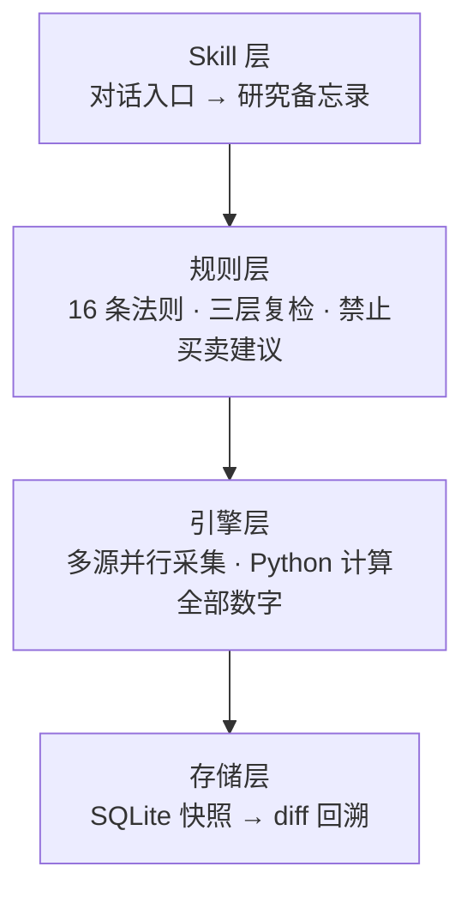

# invest-skills — 可复核的 A 股研究技能集

<p align="center">
  <a href="LICENSE"></a>
  <a href="https://www.python.org/downloads/"></a>
  <a href="https://github.com/Veblin/invest-skills/actions/workflows/validate.yml"></a>
  <a href="https://github.com/Veblin/invest-skills/releases"></a>
  <a href="#workbuddy"></a>
</p>

**每个数字可复核的 A 股投研助手。** 输入代码，自动采集公开数据、由 Python 引擎完成计算，并输出带来源、口径与不确定性标注的研究备忘录。它将手工研究中最易出错的环节——数据取数、计算、交叉验证与证据整理——固化为可检查的流程；是学习与研究工具，不是投资决策工具。

> 普通 AI 容易给出「看起来合理」的答案；invest-skills 的目标是交付一份**可独立核验**的研究备忘录。

> **定位声明**：本项目是开源软件工具，不从事证券投资咨询业务，未取得证券投资咨询业务资格；不推荐个股、不提供买卖或仓位建议、不承诺收益。完整边界见[免责声明](#免责声明)。

## 为什么值得使用

| 研究中的常见失真 | 系统性约束 | 你可以如何复核 |
|:---|:---|:---|
| AI 心算、编数字或混淆口径 | Python 计算全部衍生指标；AI 只引用结果，不加工数字 | 数字附来源与日期，计算逻辑在脚本中可审计 |
| 单一数据源失效或数据彼此冲突 | 多源并行、降级链与差异显式标注；不会静默挑选一个数字 | 报告保留来源、口径和待核验路径 |
| 叙事压过证据，只谈利好 | 16 条输出法则、事实/分析分离、Bull/Bear 数值化传导 | 每条判断必须关联事实、来源或标记为待验证 |
| 同一问题每次得到不同话术 | 固定研究结构、科学计算和 SQLite 快照 | 历史结果可 diff 回溯，区分数据变化与观点变化 |
| 只看标的，忽略市场环境 | 个股、ETF、市场脉搏、形态与方案评估共用数据层 | 同一套公开数据下比较估值、情绪、资金与风险 |
| 不知道数据被送去了哪里 | 本地运行与可审计：数据不出机、不跟踪不上报、MIT 开源 | 代码可通读，SQLite 快照留在本地，支持 diff 回溯 |

## 研究链条



这个链条的关键不是“自动写报告”，而是将研究中的证据责任落到可检查的层次：数据源失败会被记录；跨源数值冲突不会被悄悄抹平；无法证实的判断必须标注边界；技术指标仅描述市场状态，不生成交易信号。

## 能做什么

| Skill | 研究对象与产出 | 入口 |
|:---|:---|:---|
| **invest-a-stock** | 单标的九模块研究：公司、财务、估值、资金、技术状态、事件与风险 | `/invest-a-stock 600176` |
| **invest-a-etf** | ETF 的指数估值、折溢价、AUM、跟踪质量与对冲覆盖 | `/invest-a-etf 563300` |
| **invest-a-pulse** | 市场杠杆、广度、情绪、资金与估值的交叉解读 | `/invest-a-pulse` |
| **invest-a-journal** | 对既有交易方案做逻辑、盲点、仓位匹配、风险收益四维检查 | `/invest-a-journal` |
| **invest-a-gap-scan** | 沪深 300 / 中证 A500 / 科创 50 成分股的客观跳空缺口筛查 | `/invest-a-gap-scan` |
| **invest-a-pattern-scan** | LMW 双底与三角形底的形态检出，附数据窥探防护 | `/invest-a-pattern-scan` |

扫描或形态检出只说明数据是否满足预设定义，不构成交易信号或操作建议。

## 数据、计算与输出标准

| 维度 | 覆盖内容 | 主要数据路径 |
|:---|:---|:---|
| 基本面 | 公司画像、财务三表、ROE/EPS、杜邦、股东与资金 | Tushare ∥ AkShare |
| 行情与技术状态 | OHLCV、前复权 K 线、均线、MACD、RSI、波动率 | Tushare ∥ 腾讯；AkShare / Baostock / TickFlow 作为补充或降级 |
| 估值与宏观 | PE/PB 序列及分位、PE Band、ERP、美国国债利率 | Tushare；FRED；AkShare |
| ETF 与市场环境 | 折溢价、AUM、跟踪质量、市场广度、两融、情绪与资金 | AkShare / Tushare / 共用市场微观结构模块 |

报告遵循以下最低标准：

- 事实注明来源；分析注明依据；无法验证的内容明确标记为「待验证」。
- 分位数不脱离历史中位数使用；多源冲突并列呈现，不伪造确定性。
- Bull/Bear 需要给出可检查的数值传导与条件，而非形容词堆砌。
- 所有结果是本地 SQLite 快照；项目不跟踪、不上传用户的查询或持仓信息。

详细规则见 [invest-a-stock SKILL.md](skills/invest-a-stock/SKILL.md) 与[配置说明](CONFIGURATION.md)。

## 从一份报告看证据如何保留

真实历史输出 [000338 潍柴动力（2026-07-21）](docs/demos/000338-潍柴动力-2026-07-21.md) 展示了系统不回避不确定性的方式：

| 问题 | 报告中的处理方式 |
|:---|:---|
| Tushare 与 AkShare 财务数据差异 102.4% | 保留双方数据与口径差异，给出核验路径，不擅自裁决 |
| PE(TTM) 20.3x、近四年中位数 15.1x、88.1% 分位 | 同时报出绝对值、基准与位置，避免只用单一分位下结论 |
| 60 日最大回撤 24.9% | 由引擎字段直接引用，不由 AI 推算 |
| 结论证据强度 | 以强弱、来源广度、时效性和跨源可验证性四维标注 |

更多真实运行快照：[中际旭创复盘](docs/demos/300308-中际旭创-复盘-2026-08-04.md)、[科创 50 ETF](docs/demos/588000-科创50ETF-2026-08-08.md)、[市场脉搏](docs/demos/market-pulse-2026-08-03.md)。这些都是历史样例，仅用于展示格式与方法，不代表当前市场状态。

## 开始使用

选择你使用的平台即可；完整配置、Token 可选项与故障排查集中在 [CONFIGURATION.md](CONFIGURATION.md)，避免在这里重复维护教程。

| 平台 | 最短路径 |
|:---|:---|
| Claude Code | `/plugin marketplace add Veblin/invest-skills`，随后使用相应 `/invest-a-*` 入口 |
| Agent Skills 兼容平台 | `npx skills add Veblin/invest-skills` |
| 本地命令行 | `git clone https://github.com/Veblin/invest-skills.git && cd invest-skills && uv sync`，然后运行 `uv run python skills/invest-a-stock/scripts/invest.py diagnose` |
| Hermes / Gemini CLI | 通过对应 marketplace 或 extension 安装；兼容包已就绪 |

### WorkBuddy

从 [GitHub Release](https://github.com/Veblin/invest-skills/releases) 下载 `invest-skills-wb-vX.Y.Z.zip`，在 WorkBuddy 的「专家·技能·连接器 > 技能 > 添加技能 > 上传技能」导入即可，无需打开终端。安装后填写 Token 的方式见 [docs/workbuddy/](docs/workbuddy/)。

Windows 用户若改用 `git clone`：默认 `core.symlinks=false` 会把仓库 23 条技能链接物化成文本文件，导致技能发现失效。运行重建脚本（NTFS junction 重建 17 个目录链接 + 硬链接重建 6 个 commands 文件，无需管理员权限，幂等）：

```powershell
git config core.symlinks true        # 可选但推荐（避免再物化）
Set-ExecutionPolicy -Scope CurrentUser RemoteSigned   # 若策略拦截 .ps1
.\scripts\setup_workbuddy_windows.ps1
```

验证：`cmd /c dir .workbuddy\skills` 应显示 `<JUNCTION>`。

## 开发与项目资料

项目以 `SKILL.md` 开放格式分发，核心代码与测试位于 `skills/`；命令行参考见 [docs/cli.md](docs/cli.md)，贡献规范见 [CONTRIBUTORS.md](CONTRIBUTORS.md)，版本记录见 [CHANGELOG.md](CHANGELOG.md)。开发校验：`uv sync && uv run pytest`。

## 免责声明

- **工具定位**：本项目提供公开数据的采集、计算、整理与学习框架，不提供投资意见，不从事证券投资咨询业务。
- **不构成投资建议**：任何输出，包括基于明示假设的多情景估值，均不是买卖建议、目标价预测、要约或收益承诺；使用者应独立核验和决策。
- **数据限制**：公开数据可能延迟、缺失、口径不一致或错误。报告会标注冲突与不可得维度，请以公司公告、交易所和原始资料为准。
- **风险自担**：投资有风险；项目不推荐个股、不提供仓位建议，也不承诺任何收益。

## License

MIT · 本地运行 · 不跟踪不上报
