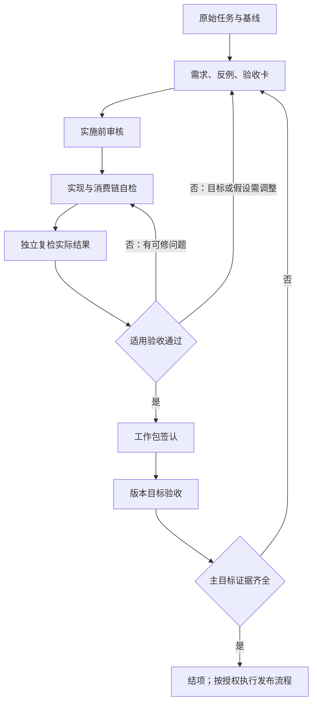

# 开发执行与验收流程

> 适用于本仓库的修复、流程改造和版本目标验收。本文是开发流程的详细定义；长期边界见 [AGENTS.md](../AGENTS.md)，代码规则见 [development-rules.md](../skills/lib/references/development-rules.md)。
> 本流程约束任务交接与完成声明，不代表已经实现报告运行时的自动准出机制。报告交付仍遵守 [delivery-qc.md](../skills/lib/references/delivery-qc.md)。

## 1. 基本原则与角色

以用户任务的实际结果作为完成标准。单项修复通过、单元测试通过、文件命名或版本号变化，都不能代替完整目标验收。

| 角色 | 负责 | 不得替代的工作 |
|---|---|---|
| 需求与验收审核者 | 澄清目标、边界、反例和验收方法，检查计划是否覆盖结果 | 不凭设计文档批准实现完成 |
| 实施者 | 复现、修改、同类路径检查、实际入口自检，提供证据 | 不用自检宣称独立复检，不自行降低完成标准 |
| 独立复检者 | 从原始任务和实际实现核验结果，复现关键反例，检查遗漏及影响 | 不仅复述实施者结论，不把局部签认扩展为版本完成 |
| 产品目标裁决者 | 用户或被明确授权的目标负责人，判断阅读价值及范围变更 | 工程审核不能冒充未经执行的用户验收 |

角色按职责划分，不按模型品牌划分；同一模型可以承担不同角色，但自检与独立复检必须如实标识。独立复检原则上使用独立会话／上下文，并自行形成判断；不同模型不自动等于独立或正确。

本流程不要求新增 Skill、一级命令、常驻 Agent 或报告运行步骤，不自动调用其他模型。既有多工具开发流程按下列交接执行；工具不可用时不得补造审核结果。

## 2. 按风险选择流程强度

| 变更 | 最少要求 |
|---|---|
| 文案、链接、低影响配置 | 简明目标、直接检查与准确完成反馈；阶段可以合并，无须新增测试或多模型轮审 |
| 确定性缺陷、局部功能 | 原反例、相关消费路径、适用回归与真实入口；复检强度按影响确定 |
| 财务语义、默认报告、QC、存储、协议、跨格式或分发链 | 完整阶段；关键反例和实际产物的独立复检 |
| 版本主要目标结项 | 各工作包证据汇总与目标级真实验收；发布检查另按 [CONTRIBUTORS.md](../CONTRIBUTORS.md) |

不用每个小任务重复全仓测试；也不能因测试昂贵就跳过必要的完整结果验证。复用证据须说明输入、实现和适用范围是否仍一致。

## 3. 阶段与准入条件



### G0：确定基线与本次范围

- 读取原始任务、适用指令与唯一生效计划；相互冲突时明确记录裁决依据。
- 记录提交基线、相关未提交文件、缺陷输入与现象。不能只写 HEAD 而忽略工作区改动。
- 从版本目标中确定本工作包的贡献，列明不处理的部分。既有正确性问题不能静默推迟。

简单任务在工作记录中简写；重要改造使用下节任务卡。私有案例与资料记录留在本机 `host-docs/`、`reports/`，公共测试使用脱敏反例。

### G1：先审核验收是否可执行

需求审核者检查任务卡是否包含：

1. 用户可观察的结果与边界，而非只列函数、栏目或文件。
2. 至少一个能触发原缺陷的反例；涉及门禁时同时给出应通过与应失败的输入。
3. 各验收项的实际入口、证据及判定责任；不把没有对象的检查视为通过。
4. 同类路径、兼容性、退出路径和回退方式。

结论只针对计划可实施、可验收。不能据此签认代码正确或产品目标完成。使用既有授权完成该阶段，不增加逐步用户审批；只有缺少必要信息或需要改变目标时才请求相应决策。

### G2：实施与自检

- 复现原问题，进行修改，再用原反例验证修复；缺陷修复需保留适用的失败证据。
- 执行 D11 同类模式检查，记录命中、处理或保留理由，并检查实际调用／字符串分派等消费路径。
- 字段、标题、槽位、状态或格式变化时，同步生产者、消费者、规范和检查器；通过失败反例证明门禁生效。
- 涉及报告时，运行默认或任务指定的真实链，检查最终 MD／HTML／分析侧车／档案在适用范围内一致；不得手工改报告掩盖实现问题。
- 删除、替换、退出默认、折叠和隐藏分别记载。改变呈现不等价于删除生成职责。
- 输出实施交接包，区分实现、自检、未验证与剩余问题，不宣称独立复检已完成。

### G3：独立复检

复检者先读取原任务、验收卡、基线、实现和实际产物，建立自己的检查清单；再对照实施者的自检说明，减少被其结论带偏。

- 自行复现原问题的关键反例与真实出口，不只运行实施者提供的探针。
- 适用时变更对象、期间、方向、时间、标题、事实 ID 或产物内容，检验应失败的输入是否被拦截。
- 核对数值的含义与用途、全文冲突、实际删除职责以及验收遗漏，不限于 diff 新增行。
- 明确哪些检查独立执行、哪些证据复用、哪些未验证。未验证不能写成通过。
- 报告发现须带位置、复现、影响和所违反的验收项。没有发现仅代表已检查范围内未发现问题。

发现问题交回实施者，复检者不在同一轮静默修改代码后自行签认。若被授权兼任修复，需记录角色切换，并补做相应复检。

### G4：修正与工作包签认

- 每个发现分配稳定 ID，记录待修、已修待验、已验证、未复现或明确后延；未复现与后延须有依据和触发条件。
- 授权范围内继续修复。修改后重验受影响项及其依赖，检查实际提交或工作区版本，不能沿用旧代码的通过记录。
- 同一问题反复出现时检查根因与接口，不靠不断添加例外绕过失败。没有固定审核轮数或“审核过两次即可完成”的规则。
- 所有必需验收项有证据，且没有未处理的阻断项，才签认工作包。记录软警告的处置和边界。

### G5：版本目标验收与结项

单独核对版本主要目标，不能将工作包通过数量累加为版本通过。

- 默认流程从原始输入生成完整真实产物；手工精选样稿、离线回放、真实联网链、读者验收分别记载。
- 涉及阅读价值时，按既有目标验证用户能回答的研究问题。自然人反馈未发生就写未发生，不用 Agent 自评冒充。
- 核实退出或删除的实际职责；检查跨工作包的参数、期间、档案、模型和输出一致性。
- 保留未达项并继续授权范围内的收尾。目标变更须显式记录，不能重写完成标准迁就实现。
- 版本结项与发布授权分开。版本号同步、提交、打包均不证明主目标验收通过，也不自动授权对外发布。

## 4. 交接材料：一张主表，少量证据

每个任务优先复用一个任务记录，按阶段追加；不为每次模型切换新建平行计划。重大改造可拆设计与案例附件，但主表唯一。

```markdown
# 任务卡
任务 ID／目标版本：
原始请求与生效计划：
基线提交／相关未提交文件：
用户期望结果：
本次范围／不处理范围：
原问题输入、复现和失败现象：
影响的生产者、消费者、检查器、规范：
退出路径／回退方式：

| 验收 ID | 预期结果 | 正例／反例 | 实际入口与证据 | 判定责任 | 状态 |
|---|---|---|---|---|---|

## 实施与自检
修改位置；同类命中处置；命令、结果与产物；未验证项。

## 独立复检
实际核查版本；自行执行与复用证据；发现 ID、复现、影响和状态。

## 签认
本次完成范围；剩余问题；能否进入下一阶段；是否支持版本目标完成。
```

状态采用待执行、通过、失败、未验证、不适用（须理由）。产物证据注明输入和生成版本；路径内容可能变化时附哈希或不可变留档位置。复检期间若实现变动，必须重新核实适用性。

失败记录保留。不得删除问题项、放松检查、伪造原文核验或补造复检记录以换取通过。

## 5. 固定的角色提示词

### 需求与验收审核者

> 依据原始任务、适用规则和当前实现审核任务卡。逐项检查目标是否可观察、正例和反例是否有效、真实消费入口是否覆盖、退出与回退是否明确。指出缺失的验收和错误假设。审查范围是需求与验收设计，不宣称代码或产品已经通过。不要扩展用户未要求的能力；在已有授权内完善任务卡。输出修正后的验收主表及进入实施的条件。

### 实施者

> 按任务卡实施并持续完成授权范围内的工作。先复现原问题，再修复并通过真实入口验证；检查同类模式和完整消费链。字段、结构或检查改变时，用应失败的反例证明门禁仍生效。涉及完整产物时执行实际生成与复检规范，不用手工样稿代替默认链。保留偏差和未验证项，提交实施与自检证据供复检。自检完成不等于独立复检或版本结项。

### 独立复检者

> 先从原始任务、验收卡、实际代码和产物形成检查清单，再核对实施者说明。自行复现关键反例和出口；检查对象、期间、时间、口径、全文一致性及规则覆盖。区分独立执行、复用证据和未验证，不只检查 diff 或重复实施者探针。逐项给出带证据的发现和验收状态，仅签认实际核查范围。存在可修问题交回实施者，不能以测试数量或无 error 推断整体完成。

### 版本目标验收者

> 对照唯一生效版本计划，核对每项主目标的用户可观察结果和实际证据。检查普通默认流程、跨工作包一致性、真实退出路径和必要的用户反馈。单项通过、版本号或文件名不作为整体完成依据。输出目标级通过、未通过或未验证及缺口；产品目标未完成时保持未结项，不通过变更措辞掩盖未达标。

## 6. 完成反馈的最低要求

说明：完成范围、实际核查版本、原问题复验、同类路径处置、真实产物、未验证项、剩余问题以及支持的验收层级。

禁止将以下情况写成整体完成：

- 测试通过，但原缺陷或完整默认产物未核验。
- 标题／结构检查没有定位对象，却宣称核心判断检查通过。
- 内容仅折叠，却宣称生成逻辑已删除。
- Agent 自检被标为自然人审核或独立复检。
- 历史局部记录被引用为当前完整版本通过。

本流程增加的是可回查责任和证据，不保证模型或审核者不会误判。发现流程本身失效时，在真实任务记录中复盘并修正规则，避免继续叠加没有执行证据的口号。
