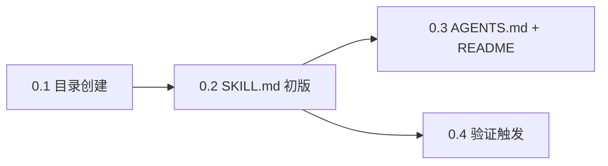
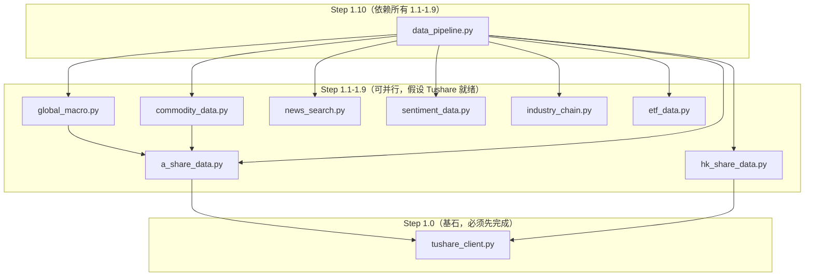
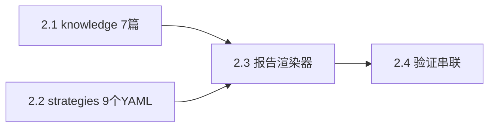
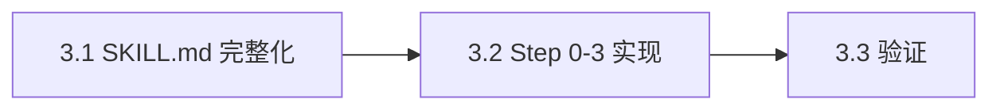
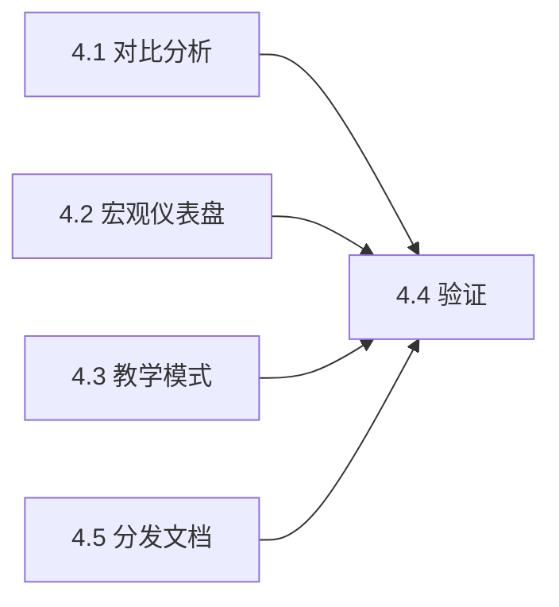
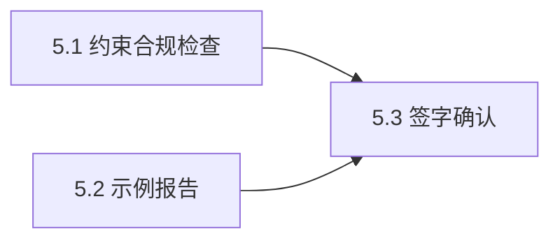
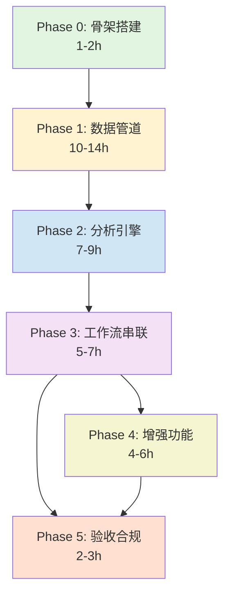

# 执行计划 · 执行步骤

> 本文件将 Phase 0-5 拆解为**最小可审查步骤**，每步 0.5–2 小时。
> 每一步都有明确的输入（前置依赖）、输出（需审阅的代码/文档）、验证标准。
>
> **原则**：每步可独立审阅 + 独立实现，不审完上一步不进入下一步。

---

## 使用方法

```
1. 审阅本文件 → 确认步骤划分是否合理
2. 从 Step 0.1 开始，逐步骤执行
3. 每步完成后在 [ ] 中打勾
4. 步骤间的关系：A → B（A 完成后 B 才能开始）
                            A ─→ C（A 完成后 C 才能开始，但 B 和 C 可并行）
                            A → B → C（必须串行）
```

---

## 阶段索引

| 阶段 | 步骤数 | 总工时 | 依赖关系 |
|------|--------|--------|---------|
| **P0: 骨架搭建** | 3 步 | 1-2h | 无依赖 |
| **P1: 数据管道** | 14 步 | 10-14h | → P0 |
| **P2: 分析引擎** | 6 步 | 7-9h | → P1 |
| **P3: 工作流串联** | 3 步 | 5-7h | → P1 → P2 |
| **P4: 增强功能** | 4 步 | 4-6h | → P3 |
| **P5: 验收合规** | 3 步 | 2-3h | → P3 → P4 |

---

## Phase 0：骨架搭建（1-2h）

> **入口条件**：项目目录 `code/` 已存在
> **目标**：`/invest-A` 可触发，即使所有数据源不可用



### Step 0.1 — 创建目录结构（0.3h）

- **输入**：无
- **输出**：目录树（空文件占位）

```
code/
  strategies/       (空)
  knowledge/        (空)
  scripts/lib/      (空)
  docs/             (空)
```

- **验证**：`tree code/` 输出如 [执行计划.md §4](./执行计划.md#4-目标目录结构mvp-完成后)
- [ ] 已完成

### Step 0.2 — SKILL.md 初版（1h）

- **前置**：Step 0.1
- **输入**：[分析报告 §6.2](./投资学习Skill分析报告.md#62-skillmd-核心结构)
- **输出**：`code/SKILL.md`

| 内容 | 来源 |
|------|------|
| Frontmatter（name/version/description/argument-hint/allowed-tools） | 分析报告 §6.2 |
| 9 条 LAWs（输出契约） | 分析报告 §6.2 |
| 7 条反模式（禁止输出示例） | 分析报告 §6.2 |
| 评分边界说明 | 分析报告 §6.2 |
| 引用格式规范 | 分析报告 §6.2 |
| Step 0-3 **高层描述**（具体命令 Phase 3 补） | — |

- **验证**：审阅 LAWs 是否全部写入，反模式是否明确
- [ ] 已完成

### Step 0.3 — AGENTS.md + README.md（0.5h）

- **前置**：Step 0.2
- **输入**：分析报告 §〇 + §6.4
- **输出**：`code/AGENTS.md` + `code/README.md`

| 文件 | 核心内容 |
|------|---------|
| AGENTS.md | 五条硬约束、目标用户画像、设计哲学、技术指标规范 |
| README.md | 项目定位（学习工具）、安装步骤、依赖列表、快速开始 |

- **验证**：README 可直接指导新人安装
- [ ] 已完成

### Step 0.4 — 验证触发（0.2h）

- **前置**：Step 0.2, 0.3
- **验证**：在 Claude Code 中执行 `/invest-A 600519`，确认 Skill 触发并返回"框架已就绪，数据源未配置"类提示
- [ ] 已完成

---

## Phase 1：核心数据管道（10-14h）

> **入口条件**：Phase 0 完成（目录存在，SKILL.md 就绪）
> **目标**：`data_pipeline.collect_all("600519")` 返回完整的七维度 dict

### 1.0 依赖结构



### Step 1.0 — Tushare 客户端 + 资金流模块（1.5h）

- **输入**：无（纯 Python 实现）
- **输出**：`scripts/lib/tushare_client.py` + `scripts/lib/fund_flow.py`

**tushare_client.py**：
```python
class TushareClient:
    def __init__(self, token: str | None = None)        # 从环境变量读取
    def is_available(self) -> bool                       # Token 有效 + 可连接
    def remaining_calls_today(self) -> int               # 今日剩余配额
    def query(self, api_name: str, **kwargs) -> pd.DataFrame  # 统一查询
```

**行为**：
- Token 无效 → `is_available()` 返回 False，不抛异常
- Token 有效但配额耗尽 → 静默降级，在报告中标注
- 不依赖 tushare SDK，走 HTTP 直连（借鉴 daily_stock_analysis）

**fund_flow.py**（附加在同一个 Step 因为它依赖 TushareClient）：
```python
def get_northbound_flow(code: str | None = None) -> pd.DataFrame   # 北向资金
def get_southbound_flow(code: str | None = None) -> pd.DataFrame   # 南向资金
def get_etf_share_change(etf_code: str) -> dict                    # Phase 6 实现
```

- **验证**：
  - [ ] 无 Token 时 `is_available()` 返回 False
  - [ ] `query("daily", ts_code="600519.SH")` 有效或返回降级信息
  - [ ] `get_northbound_flow()` 返回 DataFrame 或标注不可得
- [ ] 已完成

### Step 1.1 — A 股采集模块 · 上半（1.5h）

- **前置**：Step 1.0（TushareClient）
- **输出**：`scripts/lib/a_share_data.py`（以下函数）

```python
def get_stock_info(code: str) -> dict           # 概况、行业、实控人
def get_financials(code: str) -> dict           # 三张报表关键指标（近 3 年 + 最近季报）
def get_daily_kline(code: str, period = "daily") -> pd.DataFrame
```

**Fallback 链**（Tushare 仅在 Token 有效时优先级 -1，其余走免费）：
```
Token 有效: Tushare → akshare → efinance → baostock → 标注不可得
无 Token:   akshare → efinance → baostock → 标注不可得
```

- **验证**：
  - [ ] `get_financials("600519")` 返回含 `_meta` 的 dict
  - [ ] 断开 akshare 后自动降级到 efinance
  - [ ] 全部失败后标注不可得，不抛异常
- [ ] 已完成

### Step 1.2 — A 股采集模块 · 下半（1.5h）

- **前置**：Step 1.0
- **输出**：在 Step 1.1 的 `a_share_data.py` 中添加

```python
def get_shareholders(code: str) -> pd.DataFrame         # 十大股东
def get_governance_signals(code: str) -> dict           # 质押比例、限售解禁、商誉占比
def get_institutional_research(code: str) -> pd.DataFrame # 机构调研记录
```

- **验证**：
  - [ ] `get_governance_signals("600519")` 返回质押/解禁/商誉三项
  - [ ] 单项不可得时 dict 中对应字段为 `null` + `_meta` 标注原因
- [ ] 已完成

### Step 1.3 — 港股采集模块（1.5h）

- **前置**：Step 1.0
- **输出**：`scripts/lib/hk_share_data.py`

```python
def get_hk_stock_info(code: str) -> dict
def get_hk_financials(code: str) -> dict
def get_hk_daily_kline(code: str) -> pd.DataFrame
def get_hk_governance_signals(code: str) -> dict  # 做空比率、大股东增减持
```

**Fallback 链**：Tushare → akshare（东方财富港股频道）→ yfinance（`.HK`）
**不做**：港股深度财务数据（港股披露标准不同，标注"数据覆盖有限"）

- **验证**：
  - [ ] `get_hk_stock_info("00700")` 返回公司概况
  - [ ] `get_hk_financials("00700")` 有值或标注"港股财务覆盖有限"
- [ ] 已完成

### Step 1.4 — 全球宏观采集模块（1.5h）

- **前置**：无（独立模块）
- **输出**：`scripts/lib/global_macro.py`

```python
def get_macro_snapshot() -> dict               # 综合宏观快照
def get_fred_series(series_id: str) -> pd.Series  # FRED 单序列
def get_fedwatch_probabilities() -> dict       # CME FedWatch
def get_fx_rates() -> dict                     # 人民币/港元兑美元
def get_china_macro_snapshot() -> dict         # GDP/CPI/PMI
```

**FRED 核心序列**：`DTWEXBGS`、`DGS10`、`DGS2`、`DFII10`、`T10YIE`、`VIXCLS`、`DCOILWTICO`、`GOLDAMGBD228NLBR`、`FEDFUNDS`

**Fallback 链**：FRED（有 API Key）→ yfinance → akshare → 标注不可得

- **验证**：
  - [ ] `get_macro_snapshot()` 至少返回 6 项指标或明确标注不可得
  - [ ] 无 FRED Key 时走 yfinance 降级路径
- [ ] 已完成

### Step 1.5 — 大宗商品模块（0.5h）

- **前置**：无
- **输出**：`scripts/lib/commodity_data.py`

```python
def get_gold_price() -> dict
def get_crude_price() -> dict
```

**Fallback**：yfinance（`GC=F`, `CL=F`）→ FRED（`DCOILWTICO`, `GOLDAMGBD228NLBR`）

- **验证**：`get_gold_price()` 返回带时间戳的价格 dict
- [ ] 已完成

### Step 1.6 — 新闻搜索模块（1h）

- **前置**：无
- **输出**：`scripts/lib/news_search.py`

```python
def search_stock_news(code: str, days: int = 30) -> list[dict]
def search_industry_news(industry: str) -> list[dict]
def search_policy_news(keywords: list[str]) -> list[dict]
def search_analyst_reports(company: str) -> list[dict]
```

**Fallback 链**：Tavily（免费 1000 次/月）→ Brave（已弃用，直接走 WebSearch）→ WebSearch（Claude 内置）

**关键行为**：Tavily 无 API Key 时静默降级到 WebSearch，不报错

- **验证**：
  - [ ] `search_stock_news("600519")` 返回新闻列表（含来源 URL）
  - [ ] 无 Tavily Key 时通过 WebSearch 返回结果
- [ ] 已完成

### Step 1.7 — 情绪数据模块（1h）

- **前置**：无
- **输出**：`scripts/lib/sentiment_data.py`

```python
def get_eastmoney_sentiment(code: str) -> dict   # 东方财富股吧热度
def get_search_trends(keyword: str) -> dict       # 搜索趋势（可选）
```

**不做**：雪球爬虫（ToS 风险），代码注释说明原因并链接到 README
**不做**：Reddit 情绪（纯 A 股场景覆盖不到）

- **验证**：`get_eastmoney_sentiment("600519")` 返回热度数据或标注不可得
- [ ] 已完成

### Step 1.8 — 产业链模块 · MVP（0.5h）

- **前置**：无
- **输出**：`scripts/lib/industry_chain.py`

```python
def get_industry_context(code: str) -> dict                # 行业名、申万分类、同业列表
def search_supply_chain(industry: str) -> list[dict]       # WebSearch 研报摘要
```

**MVP 不做**：ChainKnowledgeGraph 接入（Phase 6.2）
**注解**：代码中标注"Phase 6 扩展：产业链拓扑图谱"

- **验证**：`get_industry_context("600519")` 返回申万行业分类
- [ ] 已完成

### Step 1.9 — ETF 模块 · MVP 占位（0.5h）

- **前置**：无
- **输出**：`scripts/lib/etf_data.py`

```python
def is_etf(code: str) -> bool
def get_etf_stub(code: str) -> dict   # 返回基金名称 + 跟踪指数（akshare 若有）+ "Phase 6 实现"
```

**MVP 不做**：折溢价、份额变动、跟踪误差、AUM、Top10 持仓（全部 Phase 6.1）

- **验证**：`is_etf("510300")` 返回 True，`get_etf_stub("510300")` 返回占位信息
- [ ] 已完成

### Step 1.10 — 主编排引擎 data_pipeline.py（2h）

- **前置**：Step 1.0 — 1.9（所有 lib 模块就绪）
- **输出**：`scripts/data_pipeline.py`

```python
def build_collection_plan(symbol: str, asset_type: str, dims: list[str] | None) -> dict
def collect_dimension(dim: str, symbol: str, context: dict) -> dict
def collect_all(symbol: str, *, dims=None, with_macro=False) -> dict
def save_evidence(result: dict, out_dir: str) -> str  # 写入 raw.json
```

**核心行为**：
- 按维度**并行**调用 lib 模块（`concurrent.futures`）
- 单维失败不阻断其他维度
- 每维度附加 `_meta`（source, fetched_at, confidence, fallback_chain）
- 全局统一错误处理：`{"error": ..., "attempted_sources": [...]}`

**采集顺序**（框架优先级）：财务 → 基本信息 → 行业 → 估值/技术 → 机构 → 情绪 → 宏观

- **验证**：
  - [ ] `collect_all("600519")` 返回七维度完整 dict
  - [ ] 故意断网后各维度标注"数据不可得"而非崩溃
  - [ ] 耗时 < 30s（七维度并行）
- [ ] 已完成

---

## Phase 2：分析引擎与知识库（7-9h）

> **入口条件**：`data_pipeline.py` 可正常采集数据
> **目标**：YAML 配置的分析策略 + 知识库 + 报告渲染器可串联工作

### 2.0 依赖结构



### Step 2.1 — 知识库 7 篇文档（2h）

- **前置**：无（纯 Markdown，不依赖代码）
- **输出**：`code/knowledge/*.md`（7 篇，每篇 500-1000 字）

| 文件 | 核心概念 | 字数 |
|------|---------|------|
| `valuation.md` | PE/PB 分位教学、DCF 方法论、PB-ROE 框架 | ~800 |
| `financial_metrics.md` | ROE/ROIC/FCF 解读、杜邦分析、归母 vs 扣非 | ~800 |
| `etf_guide.md` | ETF 分类、折溢价原理、跟踪误差、AUM（含 Phase 6 预告） | ~600 |
| `risk_management.md` | 质押风险、商誉减值、限售解禁、集中度 | ~600 |
| `macro_framework.md` | 美债→DCF→A 股传导、VIX、美元周期、利率→估值 | ~800 |
| `a_share_special.md` | 北向资金、产业政策、国企民企、打新制度 | ~600 |
| `hk_share_special.md` | 做空比率、联系汇率、南向资金、AH 溢价 | ~600 |

- **验证**：
  - [ ] 每篇有明确的"学习要点"段落
  - [ ] 不包含投资建议或交易策略
  - [ ] 术语与框架文档一致
- [ ] 已完成

### Step 2.2 — 策略 YAML 9 个（2h）

- **前置**：无（纯 YAML，不依赖代码）
- **输出**：`code/strategies/*.yaml`（9 个）

```yaml
# 所有 YAML 继承此骨架，仅 instructions 和 data_modules 不同
name: fundamental
display_name: 财务健康度分析
description: 基于 ROE/ROIC/FCF 的质量分析
category: fundamental
dimensions: [2]
data_modules: [a_share_data.get_financials]
instructions: |
  1. 检查 ROE 是否连续 3 年 > 15%
  2. 检查 ROIC 是否 > WACC
  3. ...
verification_checklist: |
  - [ ] 在东方财富交叉核对 ROE 数字
```

**9 个 YAML**：`basic_info`、`fundamental`、`industry`、`valuation`、`technical`、`institutional`、`sentiment`、`macro`、`etf_analysis`

**特殊规则**：
- `technical.yaml`：instructions 必须含「禁止金叉/死叉操作建议」
- `etf_analysis.yaml`：设置 `enabled: false`，说明在 Phase 6 启用

- **验证**：
  - [ ] `technical.yaml` 不含交易信号表述
  - [ ] 每个 YAML 的 `data_modules` 指向已存在的 lib 函数
- [ ] 已完成

### Step 2.3 — 报告渲染器（2h）

- **前置**：Step 2.1, 2.2（需要理解 YAML 结构和 knowledge 路径）
- **输出**：`scripts/lib/report_render.py`

```python
def render_report(dimensions: list[dict], metadata: dict) -> str
def save_html(markdown: str, path: str) -> str
def render_compare_report(reports: list[dict]) -> str
```

**模板约束**（与 LAWs 对齐）：
1. 首部 + 尾部风险声明
2. 七维度：数据表 → 分析（带来源）→ 🔍 待独立验证项
3. 尾部：数据源清单（可信度 ★，交叉验证状态）
4. 禁止：买卖建议、目标价、投资价值综合评分
5. 维度标题后可附框架权重 ★（表"重要程度"，非股票好坏）

- **验证**：
  - [ ] 用 mock 数据调用 `render_report()`，输出符合 LAWs
  - [ ] 每个数字有 `[来源: ... / 时间戳]` 格式
  - [ ] 不可得维度显示 ⚠️ 并列出 attempted_sources
- [ ] 已完成

### Step 2.4 — 模块串联验证（1h）

- **前置**：Step 1.10, 2.3
- **测试**：
  ```bash
  python -m scripts.data_pipeline --test 600519 --render
  # 输出：完整的七维度 Markdown 报告
  ```
- **验证**：
  - [ ] `/invest-A learn ROE` 引用 `financial_metrics.md`
  - [ ] mock 数据渲染的报告符合引用格式规范
  - [ ] 所有 `_meta` 字段传递到渲染层
- [ ] 已完成

---

## Phase 3：工作流串联（5-7h）

> **入口条件**：data_pipeline + strategies + render 可完整运行
> **目标**：SKILL.md 写入完整流程，`/invest-A` 命令可端到端工作



### Step 3.1 — SKILL.md 补充完整（1.5h）

- **前置**：Phase 1 + Phase 2 代码就绪
- **输入**：所有 Python 模块的接口签名
- **输出**：更新 `code/SKILL.md`

**补充内容**：Step 0-3 完整流程（Python 命令 + 参数表）

**CLI 参数表**：
| 参数 | 说明 | 对应代码 |
|------|------|---------|
| `--compare {code}` | 双标的对比 | `collect_all` × 2 + `render_compare_report` |
| `--with-macro` | 宏观联动 | `collect_all(with_macro=True)` |
| `--dim {list}` | 裁剪维度 | `collect_all(dims=list)` |
| `--deep` | 扩展验证 | 增加待验证项数量 |

**决策树**：
```
/invest-A {topic} [flags]
    ↓
Step 0 预研
    → 解析代码与市场 → 识别 asset_type（stock/hk/etf）
    → 检查 TUSHARE_TOKEN、FRED_API_KEY
    → 解析 --dim / --with-macro / --deep
    → 输出采集计划摘要（用户可确认）
    ↓
Step 1 采集 → data_pipeline.collect_all(...)
    ↓
Step 2 分析 → 加载 strategies/*.yaml
    ↓
Step 3 报告 → report_render.render_report(...)
```

**示例对话**：普通 / 对比 / 宏观 / 教学 / ETF 占位

- **验证**：审阅 SKILL.md 的决策树和参数表是否与实际代码一致
- [ ] 已完成

### Step 3.2 — Step 0 预研逻辑实现（2h）

- **前置**：Phase 2 渲染器 + SKILL.md 决策树定义
- **输出**：在 `data_pipeline.py` 或独立 `pre_research.py` 中实现 Step 0

```python
async def step0_research(symbol: str) -> dict:
    """预研：解析代码 → 市场 → 行业 → 相关 ETF → 采集计划"""
    return {
        "asset_type": "stock",      # "stock" | "hk" | "etf"
        "market": "A-share",        # "A-share" | "HK" | "US"
        "sector": "白酒",
        "related_etfs": ["512690"], # 行业 ETF
        "plan": {
            "modules": [...],
            "estimated_tokens": ...
        }
    }
```

- **验证**：`/invest-A 600519` 在采集前先显示采集计划
- [ ] 已完成

### Step 3.3 — 端到端验证（1.5h）

- **前置**：Step 3.1, 3.2
- **用例矩阵**：

| 命令 | 预期 | 
|------|------|
| `/invest-A 600519` | 七维度完整报告 |
| `/invest-A 600519 --with-macro` | 含汇率 + 宏观联动段 |
| `/invest-A 600519 --dim=finance,valuation` | 仅财务 + 估值两维 |
| `/invest-A 00700` | 港股报告 |
| `/invest-A 510300` | ETF 占位响应 + 基础知识 |
| 断网重试 | 降级路径正确 |

- [ ] 已完成

---

## Phase 4：增强功能（4-6h）

> **入口条件**：Phase 3 端到端工作流运行正常
> **目标**：对比 / 宏观仪表盘 / 教学模式可用



### Step 4.1 — 对比分析（1.5h）

- **前置**：Phase 3
- **输出**：`render_compare_report()` 实现 + SKILL.md 更新对比参数描述

```bash
/invest-A 600519 --compare 000858
# 各自 collect_all → 并排对比表，每格标注来源
```

- **验证**：对比报告的财务指标同一单元格内有双来源标注（如 `[来源: akshare / 2026-06-09]` × 2）
- [ ] 已完成

### Step 4.2 — 宏观仪表盘（1.5h）

- **前置**：`global_macro.get_macro_snapshot()` 可用
- **输出**：`/invest-A macro` 命令响应

**输出格式**：全球 + 北向/南向摘要

- **验证**：`get_macro_snapshot()` + `fund_flow` 数据输出格式与 [分析报告 §6.5 场景一](./投资学习Skill分析报告.md#场景一每日宏观快报示例) 一致
- [ ] 已完成

### Step 4.3 — 教学模式（1h）

- **前置**：`knowledge/` 就绪
- **输出**：`/invest-A learn {topic}` 命令响应

**行为**：检索 `knowledge/` + 可选 WebSearch 补充资料，不拉实时行情

- **验证**：`/invest-A learn ROE` 引用 `financial_metrics.md`
- [ ] 已完成

### Step 4.4 — 分发配置（1h）

- **输出**：`.env.example` + MCP 配置指南

**文件**：
- `.env.example`：`TUSHARE_TOKEN`、`FRED_API_KEY`、`TAVILY_API_KEY`
- README 中 MCP 章节：FinanceMCP 配置步骤 + Hermes 特定说明

- **验证**：按 README 从零配置可运行
- [ ] 已完成

---

## Phase 5：验收合规（2-3h）

> **入口条件**：Phase 3 + 4 所有命令可运行
> **目标**：逐项勾选合规清单，产出示例报告



### Step 5.1 — 约束合规 + 技术指标审查（1.5h）

- **输入**：产出的一份真实报告
- **清单**：

| 检查项 | 标准 | 
|--------|------|
| LAW 1-9 逐条核对 | 输出文件中可定位到每条 |
| 无买卖建议/目标价 | grep -r "买入\|卖出\|建仓\|目标价" — 零命中 |
| MA/MACD 仅状态描述 | technical.yaml 无"金叉买入""死叉卖出" |
| 引用格式统一 | 数字带 [来源: ...] |
| 推测语句标注 | 分析性判断含"待验证"标注 |

- **验证**：全绿通过
- [ ] 已完成

### Step 5.2 — 产出示例报告（1h）

- **输出**：`code/docs/report-example.md`

**要求**：
- 基于 600519 真实数据（或 mock 数据，标注"示例"）
- 展示七维度全部模板结构
- 数字皆标注来源

- **验证**：可直接作为新用户"这是什么样子"的参考
- [ ] 已完成

### Step 5.3 — 测试矩阵验收（0.5h）

- **测试矩阵**：对照 [实施明细 Phase 5 §5.4](./执行计划-实施明细.md#54-测试矩阵) 逐项运行

| 场景 | 结果 |
|------|------|
| A 股分析 | [ ] |
| 港股分析 | [ ] |
| `--compare` | [ ] |
| `--with-macro` | [ ] |
| `--dim` | [ ] |
| Tushare 无 Token | [ ] 降级 |
| FRED 无 Key | [ ] 降级 |
| 某维度不可得 | [ ] 标注 |

- [ ] 已完成

---

## 执行顺序一览



| 阶段 | 工时 | 条件 | 风险 |
|------|------|------|------|
| Phase 0 | 1-2h | 无 | 极低，纯文档 |
| Phase 1 | 10-14h | API 可用性 | 中等，akshare/FRED 可能和本机环境兼容问题 |
| Phase 2 | 7-9h | 纯文档 + YAML | 低 |
| Phase 3 | 5-7h | P1+P2 完整 | 中等，串联集成问题 |
| Phase 4 | 4-6h | P3 完整 | 低 |
| Phase 5 | 2-3h | P3+P4 | 低 |

**关键里程碑**：Phase 1.10 完成后首次产生结构化数据 → Phase 2.4 首次生成报告 → Phase 3.3 `/invest-A` 端到端可用。
