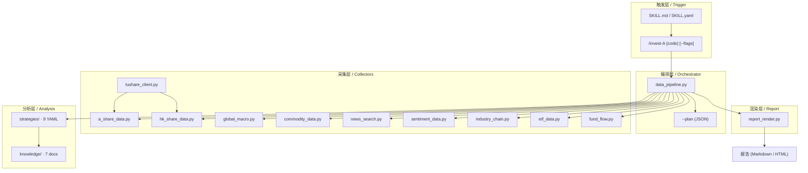
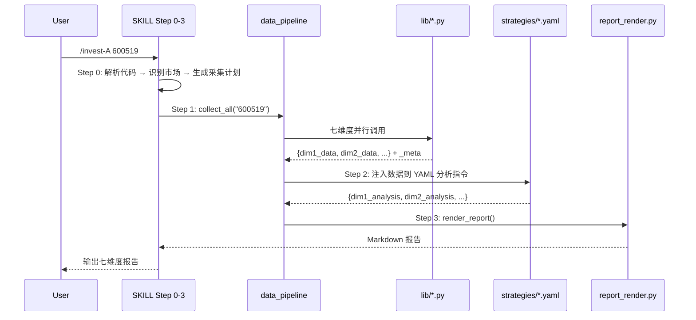
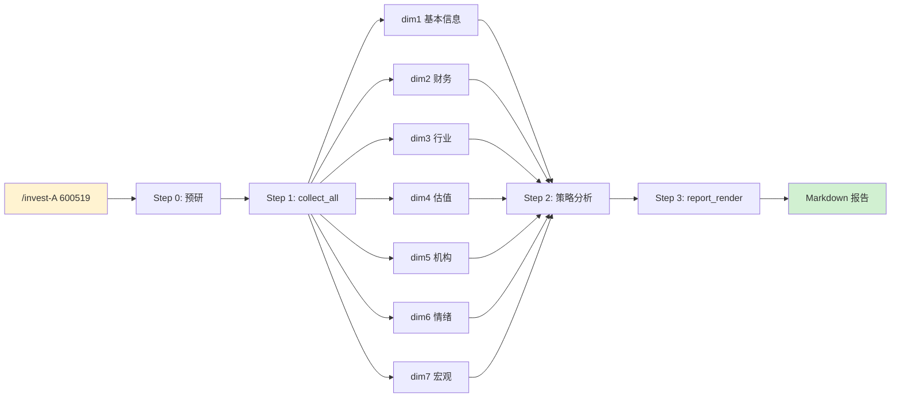

# 执行计划 · 架构关系

> 本文件定义模块边界、接口契约、依赖方向，是代码实现的架构对照图。
> 
> **主文档**：[执行计划.md](./执行计划.md) · **执行步骤**：[执行计划-执行步骤.md](./执行计划-执行步骤.md)

---

## 1. 总览分层



---

## 2. 模块接口契约

### 2.1 编排层 → 采集层

`data_pipeline.py` 定义采集层各模块的统一调用签名：

```python
# 所有采集函数的统一设计约束：
# 1. 入参: (symbol: str, **kwargs) 或 (symbol: str | None)
# 2. 返回: dict — 必须附加 _meta 字段
# 3. 异常: 不抛出，失败字段返回 {"error": ..., "attempted_sources": [...]}
# 4. 不需要 context 参数 — 纯函数

def collect_all(symbol: str, *, dims=None, with_macro=False) -> dict
    # 返回七维度 {dim1: {...}, dim2: {...}, ...}
    # 每维度包含 data + _meta

def build_collection_plan(symbol: str, asset_type: str, dims: list[str] | None) -> dict
    # 返回 JSON 查询计划（Step 0 输出）
```

### 2.2 采集模块内部契约

每个 lib 模块的 `_meta` 结构：

```python
{
    # --- 必填：数据溯源 ---
    "source": "efinance.stock_financial_abstract",  # 实际成功返回数据的接口
    "source_group": "eastmoney",                     # 数据源分组（用于交叉验证独立源判定）
    "fetched_at": "2026-06-10T14:30:00",             # ISO 8601
    "fallback_chain": ["efinance", "akshare", "baostock"],  # 完整尝试链

    # --- 必填：质量自评 ---
    "confidence": "high" | "medium" | "low",          # 数据可信度（采集模块自评，基于时效/完整性）

    # --- 必填：采集遥测（质量校准的唯一可靠依据） ---
    "latency_ms": 320,                                # 本次采集耗时（毫秒）
    "success": true,                                  # 采集是否成功
    "error_type": null | "timeout" | "empty" | "network" | "parse",  # 失败类型

    # --- 可选：特殊标注 ---
    "warning": "T+1 delay" | None,                    # 特殊提示
    "rows_fetched": 12,                               # 获取到的数据行数（K线等列表型数据时）
}
```

> **遥测契约**：`latency_ms`、`success`、`error_type` 从 Day 1 开始写入。这些字段不展示给用户，但必须持久化到 `evidence/raw.json`，作为上线后校准 S/A/B 分级和 Fallback 顺序的唯一可靠依据。参考 DSA 的 `record_provider_run()` 模式。

### 2.3 采集层 → 分析层

`data_pipeline.py` 将采集结果按维度分发给 `strategies/*.yaml`：

```yaml
# strategies/fundamental.yaml
# data_pipeline 会将 get_financials 的结果注入到这里
# instructions 中的 {data} 占位符在运行时由编排层替换

instructions: |
  根据以下财务数据进行分析（{data}）:
  1. 检查 ROE ...
```

### 2.4 分析层 → 渲染层

`report_render.py` 接收结构化维度数据：

```python
def render_report(dimensions: list[dict], metadata: dict) -> str
    # dimensions: [{"name": "财务健康度", "data": {...}, "analysis": "...", "verify_items": [...]}, ...]
    # metadata: {"symbol": "600519", "fetched_at": "...", "sources": [...]}
    # 返回: 符合 9 条 LAWs 的 Markdown 字符串
```

---

## 3. 模块依赖方向

```mermaid
flowchart LR
    subgraph "无外部依赖"
        RENDER[report_render]
        STRAT[strategies YAML]
        KNOW[knowledge docs]
    end

    subgraph "仅依赖 Python 生态（pip install）"
        TUSH[tushare_client]
        ASHARE[a_share_data]
        HK[hk_share_data]
    end

    subgraph "依赖外部 API Key（可选）"
        GM[global_macro]
        NEWS[news_search]
        SENT[sentiment_data]
    end

    subgraph "无外部编程依赖（WebSearch 兜底）"
        IND[industry_chain]
        ETF[etf_data]
    end

    ASHARE -..-> TUSH
    HK -..-> TUSH
    note right of TUSH
      并行请求
      先到先用
    end note
    DP[data_pipeline] --> ASHARE & HK & GM & NEWS & SENT & IND & ETF & FUND & COMM
    DP --> RENDER
```

---

## 4. 关键设计决策（与模块关系相关的）

### 4.1 Tushare 与 efinance 并列并行

```
┌──────────────┐     ┌──────────────┐     ┌──────────────┐
│  a_share_data │────>│  默认 fallback │────>│  标注不可得   │
│              │     │  efinance →   │     │              │
│              │     │  akshare →    │     │              │
│              │     │  baostock     │     │              │
└──────────────┘     └──────────────┘     └──────────────┘
        ∥                    ∥
        ∥ (Token 有效时      ∥
        ∥  并行请求)          ∥
   ┌──────────────┐          ∥
   │   Tushare    │          ∥
   │ (先到先用)    │          ∥
   └──────────────┘          ∥
        ∥                    ∥
        └──────────┬─────────┘
                   ▼
            ┌──────────────┐
            │ 合并去重结果  │
            │ (标注来源)    │
            └──────────────┘
```

Tushare 不再是前置拦截器，而是**与 efinance 并列的并行数据源**——两个请求同时发出，先到先用，结果合并。Token 无效时 Tushare 静默跳过，不影响主 fallback 链。这与 `resources/daily_stock_analysis` 的生产实践一致：Tushare Token 过期/积分不足/接口迁移频繁，作为唯一前置会造成单点故障。

### 4.2 ETF 是跨维度的变体，不是独立模块

```
个股分析七维度                    ETF 变体
─────────────────               ─────────────────
基本信息                        基本信息 + ETF 属性（发行商、费率、AUM）
财务报告 (三张表)                持仓结构 + 行业分布（替代财报）
行业产业链                       跟踪指数 + 成分股行业（替代产业链）
估值                            折溢价 + 跟踪误差（替代 PE/PB）
机构持仓                         份额变动 + 持有人结构
情绪舆情                         舆论情绪（相同）
宏观政策                         宏观联动（相同）
```

### 4.3 产业链模块的分阶段实现

```
Phase 1 (MVP)                    Phase 6
─────────────────               ─────────────────
get_industry_context()           接入 ChainKnowledgeGraph
  ├─ 行业名 + 申万分类           industry_chain.py 扩展
  ├─ 同业列表                    ├─ 上游原材料拓扑
  └─ WebSearch 研报摘要           └─ 下游客户拓扑
                                  ⚠️ 数据截至约 2019，来源标注
```

---

## 5. 报告生成流程（时序）



---

## 6. 文件级依赖图（构建/部署视角）

```mermaid
graph TD
    SKILL[SKILL.md] --> AGENTS[AGENTS.md]
    SKILL --> README[README.md]
    
    DP[data_pipeline.py] --> ASHARE[a_share_data.py]
    DP --> HK[hk_share_data.py]
    DP --> GM[global_macro.py]
    DP --> COMM[commodity_data.py]
    DP --> FUND[fund_flow.py]
    DP --> NEWS[news_search.py]
    DP --> SENT[sentiment_data.py]
    DP --> IND[industry_chain.py]
    DP --> ETF[etf_data.py]
    DP --> RENDER[report_render.py]
    
    ASHARE -..-> TUSH[tushare_client.py]
    HK -..-> TUSH
    note["(并行 · 先到先用)"]
    
    RENDER --> STRAT_FUND[strategies/fundamental.yaml]
    RENDER --> STRAT_BASIC[strategies/basic_info.yaml]
    RENDER --> STRAT_IND[strategies/industry.yaml]
    RENDER --> STRAT_VAL[strategies/valuation.yaml]
    RENDER --> STRAT_TECH[strategies/technical.yaml]
    RENDER --> STRAT_INST[strategies/institutional.yaml]
    RENDER --> STRAT_SENT[strategies/sentiment.yaml]
    RENDER --> STRAT_MACRO[strategies/macro.yaml]
    RENDER --> STRAT_ETF[strategies/etf_analysis.yaml]
    
    RENDER --> KNOW_VAL[knowledge/valuation.md]
    RENDER --> KNOW_FIN[knowledge/financial_metrics.md]
    RENDER --> KNOW_ETF[knowledge/etf_guide.md]
    RENDER --> KNOW_RISK[knowledge/risk_management.md]
    RENDER --> KNOW_MACRO[knowledge/macro_framework.md]
    RENDER --> KNOW_ASHARE[knowledge/a_share_special.md]
    RENDER --> KNOW_HK[knowledge/hk_share_special.md]
    
    classDef core fill:#e1f5e1,stroke:#333
    class SKILL,DP,RENDER core
    classDef lib fill:#d0e6f5,stroke:#333
    class ASHARE,HK,GM,COMM,FUND,NEWS,SENT,IND,ETF,TUSH lib
```



---

## 7. 核心数据流（从代码到报告）


